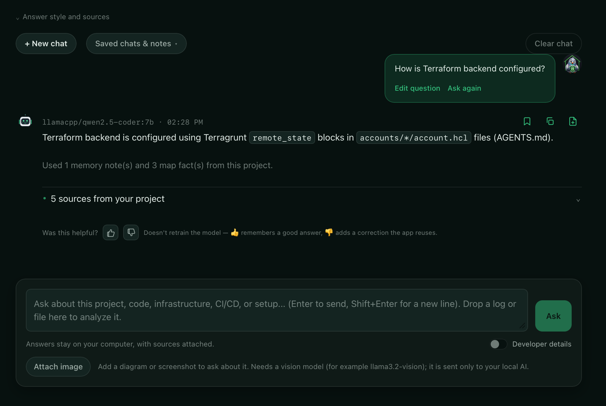

### Hi, I'm Maks

DevOps engineer. I build **local-first AI tools** — software that answers
from your own files and never phones home.

Certified across AWS (11×, incl. Solutions Architect & DevOps Professional),
Kubernetes (CKA/CKAD), Terraform and Vault over the years — most recently
**AWS Generative AI Developer – Professional** and **AI Practitioner** (2026).
Full list on [LinkedIn]([https://linkedin.com/in/YOUR_HANDLE](https://www.linkedin.com/in/maksym-tonkonozhenko-9815b4204/)).

---

**[AI Private Workspace](https://github.com/tonkonozhenko-mi/ai_private_workspace)** —
a desktop app that reads your project folder — code, Terraform, wikis,
documents — and answers questions with sources. Fully offline: local models
(llama.cpp / Ollama), no cloud, no accounts.

  

What makes it different — it knows when to say "I don't know":

| Measured, not promised | |
| --- | --- |
| Retrieval hit@5 | **95%** |
| Off-topic questions correctly refused | **100%** |
| Project questions wrongly refused | **0%** |

Measured on a 40-question golden set, default models, temperature 0, with the
repository itself as the corpus. The harness ships in the repo — run it yourself.

---

**Elsewhere:** [LinkedIn](https://linkedin.com/in/YOUR_HANDLE) ·
tonkonozhenko.mi@gmail.com

*Terraform · AWS · Kubernetes · Python · Tauri*
